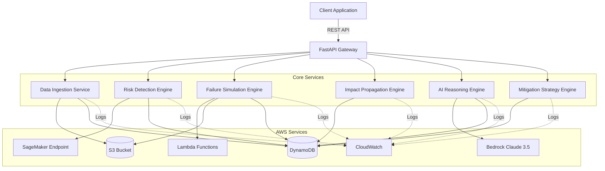
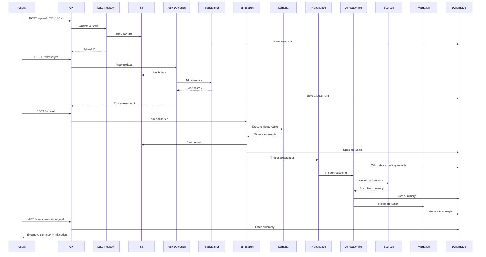

# Design Document: Retail Risk Intelligence Platform

## Overview

The Retail Risk Intelligence Platform is an AWS-native, AI-powered system that provides failure-first intelligence for retail operations. The platform combines machine learning risk detection, Monte Carlo simulation, impact propagation modeling, and generative AI reasoning to deliver actionable insights before operational failures impact revenue.

### System Goals

- Ingest and validate retail sales and inventory data at scale (up to 100MB files)
- Detect seasonal risk signals using ML-based coefficient of variation analysis
- Simulate five distinct retail failure scenarios with revenue impact quantification
- Model cascading business impacts across organizational domains
- Generate executive-ready insights using Amazon Bedrock Claude 3.5 Sonnet
- Provide ranked mitigation strategies with implementation details
- Deliver sub-30 second insights for time-sensitive decision-making

### Key Design Principles

1. **AWS-Native Architecture**: Leverage managed AWS services (S3, DynamoDB, SageMaker, Bedrock, Lambda) for scalability and operational simplicity
2. **Separation of Concerns**: Modular design with distinct engines for risk detection, simulation, propagation, AI reasoning, and mitigation
3. **Resilience-First**: Exponential backoff retries, fallback logic for AI services, graceful degradation
4. **Performance-Optimized**: Asynchronous processing, parallel execution, sub-30 second insight generation
5. **Testability**: Dependency injection, service interfaces, clear boundaries between components

## Architecture

### High-Level System Architecture



### Component Architecture

The platform follows a layered architecture:

1. **API Layer** (FastAPI): Request validation, routing, response formatting
2. **Service Layer**: Business logic orchestration, workflow coordination
3. **Engine Layer**: Specialized processing units (risk detection, simulation, AI reasoning)
4. **Storage Layer**: S3 for raw/processed data, DynamoDB for metadata and results
5. **ML/AI Layer**: SageMaker for risk detection, Bedrock for executive reasoning

### Data Flow



## Components and Interfaces

### 1. Data Ingestion Service

**Responsibility**: Validate and store uploaded retail data files

**Interface**:
```python
class DataIngestionService:
    async def upload_file(
        self, 
        file: UploadFile, 
        file_type: Literal["csv", "json"]
    ) -> UploadResponse
    
    async def validate_schema(
        self, 
        data: Union[pd.DataFrame, dict]
    ) -> ValidationResult
```

**Dependencies**:
- S3 client (boto3)
- DynamoDB client (boto3)
- Pydantic validators

**Key Operations**:
- Schema validation (required fields, data types, format)
- File size validation (max 100MB)
- S3 upload with organized prefix structure: `raw/{upload_id}/{filename}`
- DynamoDB metadata creation with partition key `upload_id`

### 2. Risk Detection Engine

**Responsibility**: Analyze seasonal volatility and classify risk levels using ML

**Interface**:
```python
class RiskDetectionEngine:
    async def analyze_risk(
        self, 
        upload_id: str
    ) -> RiskAssessment
    
    def calculate_coefficient_of_variation(
        self, 
        product_data: pd.Series
    ) -> float
    
    def classify_risk_level(
        self, 
        cv_score: float
    ) -> RiskLevel
```

**Dependencies**:
- SageMaker runtime client (boto3)
- S3 client for data retrieval
- DynamoDB client for result storage

**Key Operations**:
- Fetch processed data from S3
- Calculate rolling 30-day coefficient of variation per product
- Invoke SageMaker endpoint for ML-enhanced risk scoring
- Classify risk: low (<0.15), medium (0.15-0.3), high (>0.3)
- Store results in DynamoDB with partition key `scenario_id`

### 3. Failure Simulation Engine

**Responsibility**: Execute Monte Carlo simulations for retail failure scenarios

**Interface**:
```python
class FailureSimulationEngine:
    async def simulate_scenario(
        self, 
        scenario_type: ScenarioType,
        parameters: SimulationParameters
    ) -> SimulationResult
    
    async def invoke_lambda(
        self, 
        payload: dict
    ) -> dict
```

**Scenario Types**:
1. **Stockout**: Inventory depletion → lost sales calculation
2. **Overstock**: Holding cost accumulation → markdown requirements
3. **Seasonal Mismatch**: Demand-supply timing gaps → revenue loss
4. **Pricing Failure**: Margin erosion → competitive positioning impact
5. **Fulfillment Failure**: Delivery delays → customer churn modeling

**Dependencies**:
- Lambda client (boto3) for simulation execution
- S3 client for result storage
- DynamoDB client for metadata storage

**Key Operations**:
- Invoke Lambda function with scenario parameters
- Execute Monte Carlo simulation (configurable iterations)
- Calculate revenue loss projections, inventory impacts, timeline
- Store results in S3: `simulations/{scenario_id}/results.json`
- Store metadata in DynamoDB

### 4. Impact Propagation Engine

**Responsibility**: Model cascading effects across business domains using weighted graph

**Interface**:
```python
class ImpactPropagationEngine:
    def build_domain_graph(self) -> nx.DiGraph
    
    async def calculate_propagation(
        self, 
        scenario_id: str,
        initial_impact: float
    ) -> List[PropagationScore]
    
    def normalize_score(
        self, 
        raw_score: float
    ) -> float  # 0-10 scale
```

**Domain Graph Structure**:
- Nodes: Business domains (inventory, pricing, revenue, fulfillment, customer_satisfaction)
- Edges: Weighted relationships (0.0-1.0 representing impact strength)
- Propagation: First-order (direct) and second-order (indirect) effects

**Dependencies**:
- NetworkX for graph operations
- DynamoDB client for result storage

**Key Operations**:
- Model inventory → pricing → revenue propagation
- Model fulfillment → customer satisfaction propagation
- Calculate normalized propagation scores (0-10 scale)
- Store results in DynamoDB

### 5. AI Reasoning Engine

**Responsibility**: Generate executive summaries using Amazon Bedrock Claude 3.5 Sonnet

**Interface**:
```python
class AIReasoningEngine:
    async def generate_executive_summary(
        self, 
        scenario_id: str,
        simulation_result: SimulationResult,
        propagation_scores: List[PropagationScore]
    ) -> ExecutiveSummary
    
    async def invoke_bedrock(
        self, 
        prompt: str
    ) -> str
    
    def fallback_summary(
        self, 
        simulation_result: SimulationResult
    ) -> ExecutiveSummary
```

**Dependencies**:
- Bedrock runtime client (boto3)
- DynamoDB client for result storage

**Key Operations**:
- Construct structured prompt with simulation data and propagation scores
- Invoke Bedrock Claude 3.5 Sonnet with temperature=0.7
- Parse JSON response into ExecutiveSummary structure
- Fallback to rule-based logic if Bedrock unavailable
- Include: revenue risk quantification, market context, urgency level, recommended actions, trade-offs
- Store results in DynamoDB

### 6. Mitigation Strategy Engine

**Responsibility**: Generate ranked mitigation recommendations

**Interface**:
```python
class MitigationStrategyEngine:
    async def generate_strategies(
        self, 
        scenario_id: str,
        executive_summary: ExecutiveSummary
    ) -> List[MitigationStrategy]
    
    def rank_strategies(
        self, 
        strategies: List[MitigationStrategy]
    ) -> List[MitigationStrategy]
```

**Dependencies**:
- DynamoDB client for result storage

**Key Operations**:
- Generate scenario-specific mitigation strategies
- Assign effectiveness scores (0-100 scale)
- Assess complexity (low/medium/high)
- Estimate timeline (days) and cost range
- Rank by effectiveness score (descending)
- Store results in DynamoDB

### 7. API Gateway (FastAPI)

**Endpoints**:

```python
# Data Ingestion
POST /upload
  Request: multipart/form-data (file, file_type)
  Response: UploadResponse (upload_id, status)

# Risk Analysis
POST /risk/analyze
  Request: AnalyzeRequest (upload_id)
  Response: RiskAssessment

# Simulation
POST /simulate
  Request: SimulationRequest (scenario_type, parameters)
  Response: SimulationResponse (scenario_id, status)

# Results Retrieval
GET /propagation/{scenario_id}
  Response: PropagationResponse (scores)

GET /executive-summary/{scenario_id}
  Response: ExecutiveSummary

GET /mitigation/{scenario_id}
  Response: MitigationResponse (strategies)

# Health Check
GET /health
  Response: HealthResponse (status, timestamp)
```

**Validation**: All requests validated using Pydantic schemas

**Error Handling**:
- 400: Malformed requests
- 404: Resource not found
- 429: Rate limit exceeded
- 500: Internal server error
- 503: Service unavailable

## Data Models

### Core Data Structures (Pydantic Models)

```python
from pydantic import BaseModel, Field
from typing import Literal, Optional, List
from datetime import datetime
from enum import Enum

class RiskLevel(str, Enum):
    LOW = "low"
    MEDIUM = "medium"
    HIGH = "high"

class ScenarioType(str, Enum):
    STOCKOUT = "stockout"
    OVERSTOCK = "overstock"
    SEASONAL_MISMATCH = "seasonal_mismatch"
    PRICING_FAILURE = "pricing_failure"
    FULFILLMENT_FAILURE = "fulfillment_failure"

class Complexity(str, Enum):
    LOW = "low"
    MEDIUM = "medium"
    HIGH = "high"

# Upload Models
class UploadResponse(BaseModel):
    upload_id: str
    status: str
    timestamp: datetime
    file_size_bytes: int

class ValidationResult(BaseModel):
    is_valid: bool
    errors: List[str] = []
    warnings: List[str] = []

# Risk Assessment Models
class ProductRisk(BaseModel):
    product_id: str
    product_name: str
    coefficient_of_variation: float
    risk_level: RiskLevel
    rolling_avg_deviation: float

class RiskAssessment(BaseModel):
    assessment_id: str
    upload_id: str
    timestamp: datetime
    total_products: int
    high_risk_count: int
    medium_risk_count: int
    low_risk_count: int
    product_risks: List[ProductRisk]
    execution_time_seconds: float

# Simulation Models
class SimulationParameters(BaseModel):
    time_horizon_days: int = Field(ge=7, le=365)
    monte_carlo_iterations: int = Field(default=1000, ge=100)
    confidence_level: float = Field(default=0.95, ge=0.8, le=0.99)
    initial_inventory: Optional[int] = None
    daily_demand_mean: Optional[float] = None
    daily_demand_std: Optional[float] = None

class SimulationRequest(BaseModel):
    scenario_type: ScenarioType
    parameters: SimulationParameters
    upload_id: str

class RevenueImpact(BaseModel):
    expected_loss: float
    confidence_interval_lower: float
    confidence_interval_upper: float
    currency: str = "USD"

class InventoryImpact(BaseModel):
    units_affected: int
    holding_cost: Optional[float] = None
    markdown_required: Optional[float] = None

class SimulationResult(BaseModel):
    scenario_id: str
    scenario_type: ScenarioType
    timestamp: datetime
    revenue_impact: RevenueImpact
    inventory_impact: InventoryImpact
    timeline_days: int
    probability_of_occurrence: float
    execution_time_seconds: float

# Propagation Models
class PropagationScore(BaseModel):
    domain: str
    impact_score: float = Field(ge=0.0, le=10.0)
    propagation_order: int  # 1 for first-order, 2 for second-order
    affected_by: List[str]  # upstream domains

class PropagationResponse(BaseModel):
    scenario_id: str
    scores: List[PropagationScore]
    total_organizational_impact: float

# Executive Summary Models
class ExecutiveSummary(BaseModel):
    scenario_id: str
    timestamp: datetime
    revenue_risk_quantification: str
    market_context: str
    urgency_level: Literal["low", "medium", "high", "critical"]
    recommended_actions: List[str]
    trade_offs_analysis: str
    generated_by: Literal["bedrock", "fallback"]

# Mitigation Strategy Models
class MitigationStrategy(BaseModel):
    strategy_id: str
    title: str
    description: str
    effectiveness_score: int = Field(ge=0, le=100)
    complexity: Complexity
    timeline_days: int
    estimated_cost_min: float
    estimated_cost_max: float
    prerequisites: List[str] = []
    risks: List[str] = []

class MitigationResponse(BaseModel):
    scenario_id: str
    strategies: List[MitigationStrategy]
    timestamp: datetime
```

### DynamoDB Schema Design

**Table Name**: `retail-risk-intelligence`

**Primary Key**:
- Partition Key: `scenario_id` (String)
- Sort Key: `record_type` (String) - values: "risk_assessment", "simulation", "propagation", "executive_summary", "mitigation"

**Attributes**:
- `upload_id` (String)
- `timestamp` (String, ISO 8601)
- `data` (Map) - stores the full JSON payload
- `status` (String)
- `execution_time_seconds` (Number)

**GSI (Global Secondary Index)**:
- Index Name: `upload-id-index`
- Partition Key: `upload_id`
- Sort Key: `timestamp`

### S3 Bucket Structure

```
retail-risk-intelligence-bucket/
├── raw/
│   └── {upload_id}/
│       └── {filename}
├── processed/
│   └── {upload_id}/
│       └── processed_data.parquet
├── simulations/
│   └── {scenario_id}/
│       ├── results.json
│       ├── monte_carlo_iterations.json
│       └── metadata.json
└── logs/
    └── {date}/
        └── {log_file}.json
```

